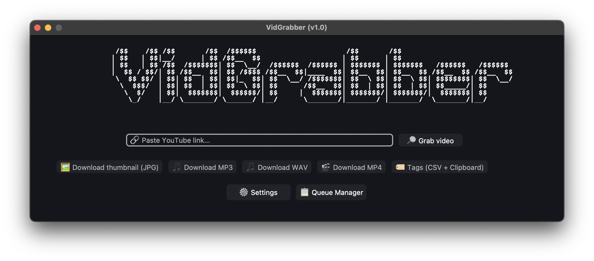

#  VidGrabber

<div align="center">


[](LICENSE)

[](https://github.com/oheyek/VidGrabber/releases)
[](https://github.com/oheyek/VidGrabber/releases)

</div>

A powerful desktop application for downloading and processing YouTube content with an intuitive interface.
<p align="center">

</p>

## ✨ Features

- **Multi-Format Downloads**: Download videos (MP4), audio (MP3/WAV), thumbnails (JPG), and tags (CSV).
- **Quality Selection**: Choose from available video qualities (144p to 2160p) with automatic detection.
- **Queue Management**: Add multiple downloads to queue and process them in batch (up to 5 concurrent downloads).
- **Smart Path Management**: Customize download locations for each file type with persistent settings.
- **Theme Customization**: Switch between Dark, Light, and System themes.
- **Tag Extraction**: Extract video tags and copy them directly to clipboard.
- **Cross-Platform**: Works seamlessly on Windows, macOS, and Linux.
- **Auto-Updates**: Automatically downloads and updates yt-dlp and ffmpeg binaries.
- **Progress Tracking**: Real-time download progress with visual indicators.

## 🛠️ Installation

### Using the Pre-built Release

1. Download the appropriate executable for your platform from
   the [Releases](https://github.com/oheyek/VidGrabber/releases) page:
    - Windows: `VidGrabber.exe`
    - macOS: `VidGrabber.app`
    - Linux: `VidGrabber`
2. Run the downloaded executable.
3. On first launch, the app will automatically download required binaries (yt-dlp and ffmpeg).

### Running from Source

```bash
# Clone the repository
git clone https://github.com/oheyek/VidGrabber.git
cd VidGrabber

# Install dependencies
pip install -r requirements.txt

# Run the application
python main.py
```

## 🎯 Usage

### Basic Download

1. Paste a YouTube link into the input field.
2. Click **"🔎 Grab video"** to fetch video information.
3. Select your desired download option:
    - **🖼️ Download thumbnail (JPG)** - Get the video thumbnail
    - **🎵 Download MP3/WAV** - Extract audio only
    - **🎬 Download MP4** - Download video (select quality)
    - **🏷️ Tags (CSV + Clipboard)** - Extract video tags

### Queue Management

1. Click **"📋 Queue Manager"** to open the queue window.
2. When fetching video info, choose **"➕ Add to Queue"** instead of immediate download.
3. Add multiple items to the queue (max 5 per category).
4. Click **"▶️ Download All"** to process all queued downloads.
5. Use **"🗑️ Clear All"** to remove all items from queue.

### Customizing Settings

1. Click **"⚙️ Settings"** button.
2. **Appearance Tab**: Choose between Dark, Light, or System theme.
3. **Downloads Tab**: Set custom download paths for each file type (MP4, MP3, WAV, JPG, Tags).
4. **Credits Tab**: View app information and support links.

## 📋 Available Downloads

| Type          | Format | Description                                 |
|---------------|--------|---------------------------------------------|
| **Video**     | MP4    | Download in multiple qualities (144p-2160p) |
| **Audio**     | MP3    | Extract audio with 192K bitrate             |
| **Audio**     | WAV    | Extract high-quality uncompressed audio     |
| **Thumbnail** | JPG    | Download video thumbnail image              |
| **Tags**      | CSV    | Extract video tags to CSV and clipboard     |

## 🔧 Technical Details

- **Language**: Python 3
- **GUI Framework**: CustomTkinter 5.2.2
- **Download Engine**: yt-dlp (auto-updated)
- **Media Processing**: ffmpeg (auto-downloaded)
- **Async Support**: asyncio for non-blocking operations
- **Clipboard**: pyperclip for tag copying
- **Logging**: Comprehensive logging system for debugging

### Key Dependencies

```
customtkinter==5.2.2
pyperclip==1.11.0
pillow==12.0.0
pytest==8.4.2
pytest-asyncio==1.2.0
```

## 🏗️ Building from Source

### Windows

```bash
pyinstaller win.spec
```

### macOS

```bash
pyinstaller macos.spec
```

### Linux

```bash
pyinstaller linux.spec
```

The built executables will be located in the `dist/` directory.

## 🗂️ Project Structure

```
VidGrabber/
├── main.py                      # Application entry point
├── src/
│   ├── downloader.py           # Video/audio download logic
│   ├── video_info.py           # YouTube video information fetcher
│   ├── thumbnail_downloader.py # Thumbnail download handler
│   ├── tag_extractor.py        # Tag extraction and CSV export
│   ├── path_manager.py         # Download path management
│   ├── logger.py               # Logging functionality
│   ├── updater.py              # Binary updater (yt-dlp, ffmpeg)
│   ├── queue/
│   │   └── download_queue.py   # Queue management system
│   └── ui/
│       ├── interface.py        # Main application UI
│       ├── queue_window.py     # Queue manager window
│       ├── themes/
│       │   └── basalt.json     # Custom theme
│       └── icons/
│           ├── icon.ico        # Windows icon
│           ├── icon.icns       # macOS icon
│           └── icon.png        # Linux icon
├── tests/                       # Unit tests
│   ├── conftest.py             # Pytest configuration
│   ├── test_downloader.py      # Downloader tests
│   ├── test_video_info.py      # Video info tests
│   ├── test_thumbnail_downloader.py
│   ├── test_tag_extractor.py
│   └── test_download_queue.py
├── requirements.txt            # Python dependencies
├── win.spec                    # PyInstaller config for Windows
├── macos.spec                  # PyInstaller config for macOS
├── linux.spec                  # PyInstaller config for Linux
├── Doxyfile                    # Documentation configuration
└── README.md                   # This file
```

## 🧪 Testing

The project includes comprehensive unit tests for all core functionality.

### Running Tests

```bash
# Install test dependencies
pip install pytest pytest-asyncio

# Run all tests
pytest

# Run specific test file
pytest tests/test_downloader.py

# Run with verbose output
pytest -v

# Run with coverage
pytest --cov=src tests/
```

### Test Coverage

- **Video Download Tests**: URL validation, quality selection, error handling
- **Audio Download Tests**: MP3/WAV format validation, invalid input handling
- **Thumbnail Tests**: Download validation, error cases
- **Tag Extraction Tests**: CSV generation, clipboard copying
- **Queue Management Tests**: Adding items, queue limits, batch processing
- **Video Info Tests**: URL cleaning, metadata extraction

## 🤝 Contributions

Contributions are welcome! Here's how you can help:

1. Fork the repository
2. Create a new feature branch (`git checkout -b feature/amazing-feature`)
3. Commit your changes (`git commit -m 'Add amazing feature'`)
4. Push to the branch (`git push origin feature/amazing-feature`)
5. Open a Pull Request

## 📄 License

This project is open source and available under the [MIT License](LICENSE).

---

**Happy Downloading! 🎉**

## Author

Made with ❤️ by ohey<br>
[](https://www.buymeacoffee.com/ohey)

---

If you find this project useful, consider buying me a coffee! ☕